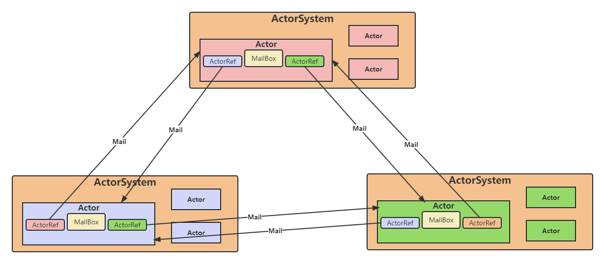

### Flink RPC
#### Flink RPC底层实现：Akka
Flink的RPC实现：基于Scala的网络编程库：Akka:Akka的特点总结
```
1.它是对并发模型进行了更高的抽象
2.它是异步、非阻塞、高性能的事件驱动编程模型
3.它是轻量级事件处理(1GB内存可以容纳百万级别个Actor)
```
关于对Akka的ActorSystem和Actor的理解：
```
1.ActorSystem是管理Actor生命周期的组件,Actor是负责进行通信的组件
2.每个Actor都有一个MaxlBox,别的Actor发送给他的消息都先存储在MailBox中,通过这种方式可以实现异步通信
3.每个Actor是单线程的处理方式,不断的从MailBox拉取消息执行处理,所以对于Actor的消息处理,不适合调用会阻塞的处理方法
4.Actor可以改变他自身的状态,可以接收消息,也可以发送消息,还可以生成新的Actor
5.每一个ActorSystem和Actor都在启动的时候会给定一个name,如果要从ActorSystem中,获取一个Actor,则通过一下的方式来进行Actor的获取, akka.tcp://actorsystem_name@bigdata02:9527/user/actor_name 来进行定位
6.如果一个Actor要和另一个Actor进行通信,必须先获取对方的Actor的ActorRef对象,然后通过该对象发送消息即可
7.通过tell发送异步消息,不接受响应,通过ask发送异步消息,得到Future返回,通过异步回到返回处理结果
```

#### 使用Akka模拟实现Flink Standalone
##### 使用Akka模拟实现Flink Standalone

#### 深入理解Flink RPC
```
Flink: XXXGateway: JobManager(ResourceManager) TaskManager(TaskExecutor)在TaskExecutor的内部，持有ResourceManager的一个Gateway对象
1.Akka Actor = Flink RpcEndpoint
2.AKka ActorRef = Flink XXXGateway
```
在阅读源码过程中，如果看到以下这类型的代码，其实就是在发送RPC请求
```
// resourceManagerGateway 就可以理解成： 当前节点中，对于 ResourceManager 代理对象的封装
resourceManagerGateway.requestSlot();
// 代码跳转到：resourceManager.requestSlot();
```
Flink中的RpcEndpoint,在作用上,等同于Akka中的Actor
Spark的RPC实现虽然是为了替换Akka而诞生的,但是它实际上可以看成一个简易版的Akka,仍然遵循许多Actor Model的抽象。例如
- 大
