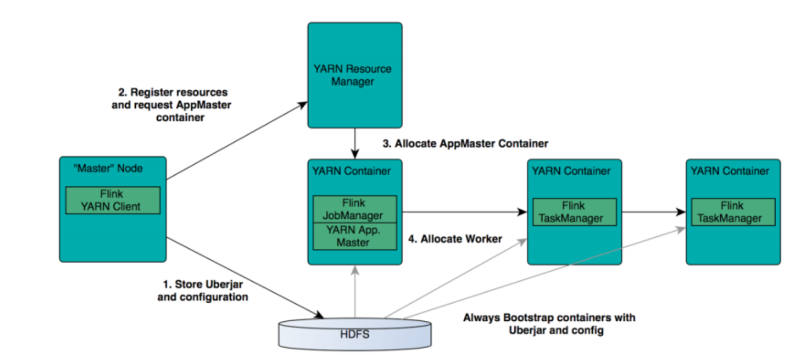
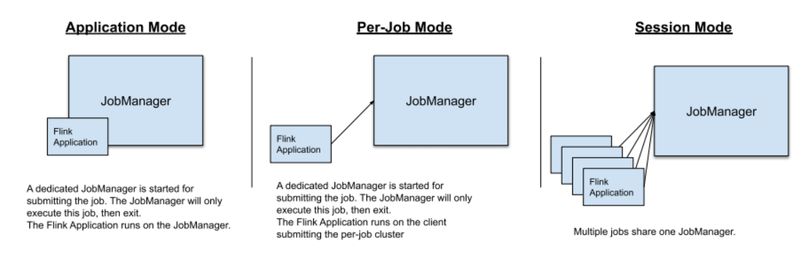
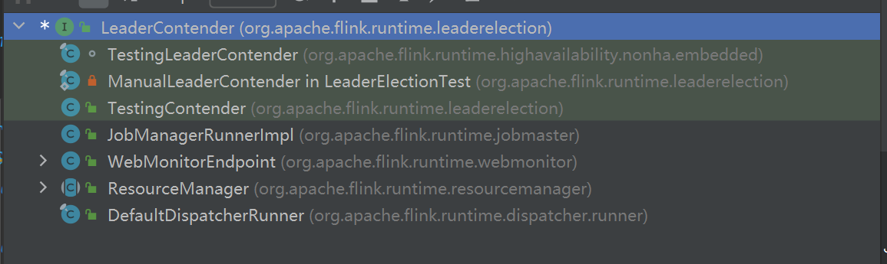
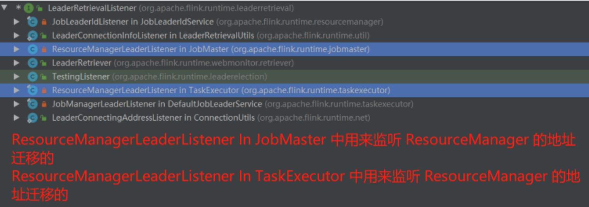
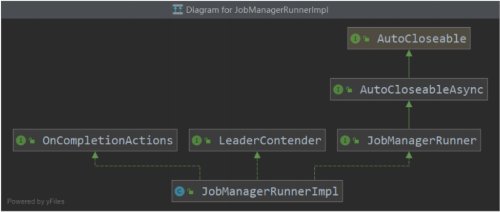
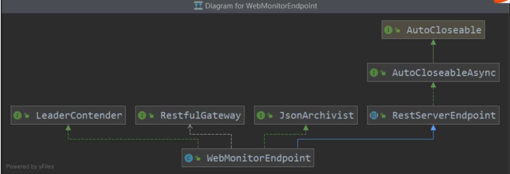
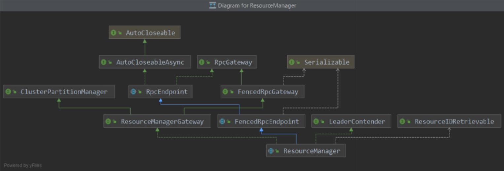
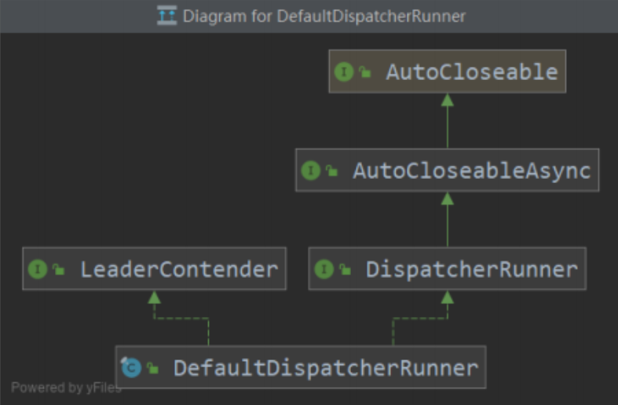

### Flink RPC
#### Flink RPC底层实现：Akka
Flink的RPC实现：基于Scala的网络编程库：Akka:Akka的特点总结
```
1.它是对并发模型进行了更高的抽象
2.它是异步、非阻塞、高性能的事件驱动编程模型
3.它是轻量级事件处理(1GB内存可以容纳百万级别个Actor)
```
关于对Akka的ActorSystem和Actor的理解：
```
1.ActorSystem是管理Actor生命周期的组件,Actor是负责进行通信的组件
2.每个Actor都有一个MaxlBox,别的Actor发送给他的消息都先存储在MailBox中,通过这种方式可以实现异步通信
3.每个Actor是单线程的处理方式,不断的从MailBox拉取消息执行处理,所以对于Actor的消息处理,不适合调用会阻塞的处理方法
4.Actor可以改变他自身的状态,可以接收消息,也可以发送消息,还可以生成新的Actor
5.每一个ActorSystem和Actor都在启动的时候会给定一个name,如果要从ActorSystem中,获取一个Actor,则通过一下的方式来进行Actor的获取, akka.tcp://actorsystem_name@bigdata02:9527/user/actor_name 来进行定位
6.如果一个Actor要和另一个Actor进行通信,必须先获取对方的Actor的ActorRef对象,然后通过该对象发送消息即可
7.通过tell发送异步消息,不接受响应,通过ask发送异步消息,得到Future返回,通过异步回到返回处理结果
```

#### 使用Akka模拟实现Flink Standalone

#### 深入理解Flink RPC
```
Flink: XXXGateway: JobManager(ResourceManager) TaskManager(TaskExecutor)在TaskExecutor的内部，持有ResourceManager的一个Gateway对象
1.Akka Actor = Flink RpcEndpoint
2.AKka ActorRef = Flink XXXGateway
```
在阅读源码过程中，如果看到以下这类型的代码，其实就是在发送RPC请求
```
// resourceManagerGateway 就可以理解成： 当前节点中，对于 ResourceManager 代理对象的封装
resourceManagerGateway.requestSlot();
// 代码跳转到：resourceManager.requestSlot();
```
Flink中的RpcEndpoint,在作用上,等同于Akka中的Actor
Spark的RPC实现虽然是为了替换Akka而诞生的,但是它实际上可以看成一个简易版的Akka,仍然遵循许多Actor Model的抽象。例如
- RpcEndpoint对应Actor
- RpcEndpointRef(被包装在Gateway对象的内部)对应ActorRef
- RpcEnv对应ActorSystem
Flink中的RPC实现主要在flink-runtime模块下org.apache.flink.runtime.rpc包中,涉及到的最重要的API主要是一下四个:

|     组件      | 意义                                                                                                                                                              |
|:-----------:|-----------------------------------------------------------------------------------------------------------------------------------------------------------------|
| RpcGateway  | 用于远程调用的代理接口。RpcGateway提供了获取其代理的RpcEndpoint的地址的方法。在实现一个提供RPC调用的组件时，通常需要先定一个接口，该接口继承RpcGateway并约定好提供的远程调用方法。                                                      |
|  RpcServer  | 相当于RpcEndpoint自身的代理对象(self gareway)。RpcSerer是RpcService启动了RpcEndpoint之后返回的对象，每一个RpcEndpoint对象内部都有一个RpcServer的成员变量，通过getSelfGateway方法获取自身的代理，然后调用该Endpoint提供的服务。 |
| RpcEndpoint | 对RPC框架中提供具体的实体的抽象，所有提供远程调用方法的组件都需要继承该抽象类。另外，对于同一个RpcEndpoint的所有RPC调用都会在同一个线程（RpcEndpoint"主线程"）中执行，因此无需担心并发执行的线程安全问题。                                            |
| RpcService  | 是 RpcEndpoint 的运行时环境，RpcService 提供了启动 RpcEndpoint , 连接到远端 RpcEndpoint 并返回远端 RpcEndpoint 的代理对象等方法。此外，RpcService 还提供了某些异步任务或者周期性调度任务的方法。内部包装了 ActorSystem。        |
总结:
```
1.RpcGateway   路由,RPC的老祖宗，各种其他RPC组件，都是RpcGateway的子类
2.RpcServer    RpcService(ActorSystem)和RpcEndpoint(Actor)之间的粘合层
3.RpcEndpoint  业务逻辑载体，对应的Actor的封装
4.RpcService   对应ActorSystem的封装
```

RpcEndpoint中有四个比较重要的的子类:
```
1.TaskExecutor  集群中从节点中最重要的角色,负责资源管理
2.Dispatcher    主节点中的一个工作角色,负责job调度执行
3.JobMaster     应用程序中的主控程序,类似于Spark中的Driver的作用,或者MapReduce中的ApplicationMaster
4.ResourceManager 集群中的主节点JobManager中的负责资源管理角色,和TaskExecutor一起构成资源管理的主从架构。
```
当在任意地方发现要创建这四个组件的任何一个组件的实例对象的时候，创建成功了之后，都会要调用 start() 去启动这个 RpcEndpoint，然后就会去执行他的 RpcEndpoint 的 onStart() 方法，一般来说，对应的 RpcEndpoint 组件都会重写，在这些 RpcEndpoint 组件启动的时候，一些重要的逻辑，都有可能被放在这个 onStart() 生命周期方法里。
#### Flink RPC案例
#### RpcEndpoint 
##### JobManager的ResourceManager
Flink Standalone集群是一个主从架构,主节点叫做JobManager,从节点叫做TaskManager,在JobManager的内部,其实三大组件,如图:

其中，ResourceManager 的职责就是帮助 主节点 JobManager 完成从节点 TaskManager 的管理和资源的管理和分配等工作。

##### TaskManager的TaskExecutor
Flink Standalone 集群是一个主从架构，主节点叫做 JobManager，从节点叫做 TaskManager

这个 TaskExecutor 是存在于 TaskManager 的内部，真正完全，资源提供和分配，接收任务和执行等相关工作。这个角色的意义更等同于 Spark 中的Worker， YARN 集群中的 NodeManager。
#### Flink应用程序抽象
Flink Client提交Job之后:整个这个Job的概念会发送三次改变生成四个概念
```
1.提交到JobManager之前,会从flink code生成StreamGraph,JobGraph
2.客户端其实是提交JobGraph给服务端,还要转换成ExecutionGraph,然后再转换成物理Task,申请slot资源,部署Task执行。
```
几个基础概念:
```
1.Function
2.StreamOperator
3.Transformation
4.StreamNode
```
Flink的一个Job,最终,归根结底,还是构建一个高效的能用于分布式并行执行的DAG执行图。
Flink中的Job被抽象成Graph进行管理,执行图Graph可以分成四层:StreamGraph => JobGraph => ExecutionGraph => 物理执行图
StreamGraph:是根据用户通过Stream API编写的代码生成的最初的图。用来表示程序的拓扑结构。
JobGraph:StreamGraph 经过优化后生成了 JobGraph，提交给 JobManager 的数据结构。主要的优化为，将多个符合条件的节点 chain 在一起作为一个节点，这样可以减少数据在节点之间流动所需要的序列化反序列化传输消耗。
ExecutionGraph:JobManager 根据 JobGraph 生成 ExecutionGraph。ExecutionGraph 是 JobGraph 的并行化版本，是调度层最核心的数据结构。
物理执行图:JobManager 根据 ExecutionGraph 对 Job 进行调度后，在各个 TaskManager 上部署 Task 后形成的图，并不是一个具体的数据结构。

- 从JobGraph的图里可以看到,数据从上一个operator(JobVertex)流到下一个operator(JobVertex)的过程中,上游作为生产者提供了IntermediateDataSet,而下游作为消费者需要JobEdge。事实上,JobEdge是一个通信管道连接了上游生产的 dataset和下游的 JobVertex 节点。
- 在JobGraph转换到ExecutionGraph的过程中,主要发生了以下转变:
    + 加入了并行度的概念,称为真正可调度的图结构
    + 生成了与JobVertex对应的ExecutionJobVertex,ExecutionVertex,与IntermediateDataSet对应的IntermediateResult和IntermediateResultPartition等,并行将通过这些类实现
    + ExecutionGraph已经可以用于调度任务,可以看到,Flink根据该图生成了一一对应的Task。每个 Task 对应一个ExecutionGraph 的一个Execution。Task 用 InputGate、InputChannel 和 ResultPartition 对应了上面图中的 IntermediateResult和 ExecutionEdge。

为什么要这么要设计这么四层的执行逻辑？它的意义是什么？
```
1.StreamGraph是对用户逻辑的映射
2.JobGraph在StreamGraph基础上进行了一些优化,比如把一部分操作成chain以提高效率
3.ExecutionGraph是为了调度存在的,加入了并行处理的概念
4.物理执行结构,真正执行的是Task及其相关结构
```
##### StreamGraph
StreamGraph:根据用户通过Stream API编写的代码生成的最初的图。Flink把每一个算子transform成一个对流的转换(比如SingleOutputStreamOperator,它就是一个DataStream的子类),并且注册到执行环境中,用于生成StreamGraph。
它包含的主要抽象概念有:
```
1.StreamNode:用来代表operator的类,并具有所有相关的属性,如并发度、入边和出边等。
2.StreamEdge：表示连接两个StreamNode的边。
```
##### JobGraph
JobGraph:StreamGraph经过优化后生成了JobGraph,提交给JobManager的数据结构
它包含的主要抽象概念有:
```
1.JobVertex:经过优化后负荷条件的多个StreamNode可能会chain在一起生成一个JobVertex，既一个JobVertex包含一个或多个operator,JobVertex的输入是JobEdge,输出是IntermediateDataSet
2.IntermediateDataSet：表示JobVertex的输出，即经过operator处理产生的数据集。producer是JobVertex，consumer是JobEdge
3.JobEgde:代表了job graph中的一条数据传输通道。source是IntermediateDataSet,target是JobVertex。既数据通过JobEdge由IntermediateDataSet传递给目标JobVertex。
```
##### ExecutionGraph
ExecutionGraph：JobManager(JobMaster)根据JobGraph生成ExecutionGraph。ExecutionGraph是JobGraph的并行化版本,是调度层最核心的数据结构。
它包含的主要抽象概念有:
```
1.ExecutionJobVertex：和JobGraph中的JobVertex一一对应，每一个ExecutionJobVertex都有和并发度一样多的ExecutionVertex。
2.ExecutionVertex：表示ExecutionJobVertex的其中一个并发子任务，输入是ExecutionEdge，输出是IntermediateResultPartition。
3.IntermediateResult:和JobGraph中的IntermediateDataSet一一对应。一个IntermediateResult包含多个IntermediateResultPartition，其个数等于operator的并发度
4.IntermediateResultPartitoin：表示ExecutionVertex的一个输出分区，producer是ExecutionVertex，consumer是若干个ExcutionEdge
5.ExecutionEdge:表示ExecutionVertex的输入，source是IntermediateResultPartition,target是ExecutionVertex。source和target都是只能是一个
6.Excution：是执行一个ExcutionVertex的一次尝试。当发生故障或者数据苏姚重算的情况下ExecutionVertex可能会有多个ExcutionAttemptID。一个Excution通过ExcutionAttemtID来唯一标识。JM和JM之间关于task的部署和task status的更新都是通过ExecutionAttemptID 来确定消息接受者。
```
##### 物理执行图
物理执行图：JobManager根据ExecutionGraph对Job进行调度后，在各个TaskManager上部署Task后形成的“图”，并不是一个具体的数据结构。
它包含的主要抽象概念有：
```
1.Task：Excution被调度后在分配的TaskManager中启动对应的Task。Task包裹了具有用户执行逻辑的operator。
2.ResultPartition：代表由一个Task的生成的数据，和ExecutionGraph中的IntermediateResultPartition一一对应。
3.ResultSubpartition：是ResultPartion的一个子分区。每个ResultPartition包含过个ReslutSubpartition，其数目要由下游消费Task数和DistribuionPattern来决定
4.InputeFate：代表Task的输入封装，和JobGraph中JobEdge一一对应，每个InputGate消费了一个或多个的ResultPartition
5.InputeChannel：每个InputGate会包含一个以上的InputeChannel，和ExcutionGraph中的ExcutionEdge一一对应，也和ResultSubpartition一对一地相连，即一个InputChannel接收一个ResultSubpartition的输出
```
#### Flink Job三种运行模式
如果是Flink Standalone集群:
```
./bin/flink run --target locl #Local submission using a MiniCluster in Session Mode
./bin/flink run --target remote # Submission to an already running Flink cluster
```
Flink的Job部署模式有多种，支持YARN、Kubernetes、Mesos，重点探讨Flink On Yarn

在图中可以看出，Flink与Yarn的关系与MapReduce和Yarn的关系是一样的。Flink通过Yarn的接口实现了自己的AppMaster。当在YARN中部署Flink，YARN就会用自己的Container来启动Flink的JobManager（也就是AppMaster）和TaskManager。
Flink On Yarn的三种模式
```
./bin/flink run --target yarn-session # Submission to an already running Flink on YARN cluster
./bin/flink run --target yarn-per-job # Submission spinning up a Flink on YARN cluster in Per-Job
./bin/flink run-application --target yarn-application # Submission spinning up Flink on YARN cluster in Application Mode
```

- Session模式：在YARN中初始化一个FLink集群，开辟指定的资源，之后我们提交的Flink Job都在这个Flink yarn-session中，也就是说不管提交多少个Job，这些Job都会共用开始时在YARN中申请的资源，这个Flink集群会常驻在YARN集群中，除非手动停止。
- Per-Job模式：在YARN中，每次提交job都会创建一个新的Flink集群，任务之间相互独立，互不影响并且方便管理。任务执行完成之后创建的集群也会消失，所以每个Job执行完毕，Flink集群关闭，释放资源。

|      模式       | 优点                                                                                                                                       | 缺点                                 | 应用场景        |
|:-------------:|------------------------------------------------------------------------------------------------------------------------------------------|------------------------------------|-------------|
|   Session模式   | 一次资源分配，多次job执行，充分利用资源，job启动快                                                                                                             | 一直占据资源，可能导致连锁重启，JobManager负载大      | 小规模短时间运行的作业 |
|   Per-Job模式   | 资源分配粒度更细，方便单个JOb的管理                                                                                                                      | 当提交Job的Client集中的时候，会加重负载(带宽和CPU消耗) | 大规模长时间运行的作业 |
| Application模式 | 应用jar包的main函数(用户类的main函数)将会在JobManager上执行，只要应用程序执行结束，Flink集群会马上被关闭，也可以手动停止集群，与Per-Job-Cluster的区别: 就是Application Mode下, 用户的main函数是在集群中执行的 |
具体可以参考官方文档
<https://ci.apache.org/projects/flink/flink-docs-stable/deployment/cli.html>

<https://ci.apache.org/projects/flink/flink-docs-stable/deployment/cli.html#advanced-cli>

<https://ci.apache.org/projects/flink/flink-docs-stable/deployment/resource-providers/yarn.html>
Flink On YARN不同的模式，其实入口是不一样的，总的来说是：ClusterEntryPoint，ClusterEntryPoint 是 Flink 集群模式的入口基类，它有三种实现：
```
org.apache.flink.runtime.entrypoint.SessionClusterEntrypoint
org.apache.flink.runtime.entrypoint.JobClusterEntrypoint
org.apache.flink.client.deployment.application.ApplicationClusterEntryPoint
```
其中 SessionClusterEntrypoint 又有四种实现：
```
org.apache.flink.runtime.entrypoint.StandaloneSessionClusterEntrypoint
org.apache.flink.mesos.entrypoint.MesosSessionClusterEntrypoint
org.apache.flink.mesos.entrypoint.YarnSessionClusterEntrypoint
org.apache.flink.mesos.entrypoint.KubernetesSessionClusterEntrypoint
```
#### Flink选举和监听机制
Flink的选举和监听机制，都是依托于Curator框架的API进行封装提供了的实现，具体设计到的实现类包括：LeaderContender和LeaderElectionService和LeaderRetrievalService
```
1.LeaderContender 参选者 竞选者 (namenode1 namenode2)
2.LeaderElectionServer 选举服务
3.LeaderRetrievalService 监听服务
```
在Flink中，封装了一个选举服务端叫做：LeaderElectionService，接口定义如下：
```java
//一种服务接口，允许在一组竞争者中选举一位领导者
//使用此服务之前 必须先调用start方法将其启动
//启动方法将竞争者作为参数，如果有对个竞选者，那么每个竞争者都必须实例化自己的领导者选举服务
//授予竞争者领导权后，他必须通过调用方法{@link #confirmLeadership（UUID，String）}
//来确认收到的领导者会话ID 。这将通知领导者选举服务，竞争者已接受指定的领导者，
//并且领导者会话ID和领导者地址现在可以发布用于领导者检索服务。
public interface LeaderElectionService {
// 启动选举，启动方法将竞争者作为参数
void start(LeaderContender contender) throws Exception;
// 停止
void stop() throws Exception;
// 确认
void confirmLeadership(UUID leaderSessionID, String leaderAddress);
// 判断是否拥有指定session下的leadership
boolean hasLeadership(@Nonnull UUID leaderSessionId);
}
```
LeaderContender是LeaderElectionService中的参与选举的竞选者。它有四种实现：

这四个经选者类中，都有一个LeaderElectionService的选举服务实例对象！完整的逻辑：
```
1.初始化选举对象 X.X的内部拥有一个LeaderElectionService选举服务实例
2.X会在某个时机调用，leaderElectionService.start(this);执行选举，此时x = this
3.如果竞选成功，则会回调：LeaderContender.grantLeadership(session)方法
4.正常来说，会有很多的服务应该是竞选成功才启动或者执行某些操作，这些业务代码，都在grantLeadership方法中进行定义
```
LeaderElectionService 的默认实现是基于 ZooKeeper 的 DefaultLeaderElectionService。在 DefaultLeaderElectionService 的内部封装了一个ZooKeeperLeaderElectionDriver 来执行选举和监听。ZooKeeperLeaderElectionDriver 是 FLink-1.12 版本的一个改进，优化了代码的阅读。但是整体逻辑没变。当 ZooKeeperLeaderElectionDriver 去选举的时候，由内部的基于 Curator 的 LeaderLatch 来执行选举，并且注册了监听。实质上，当Drvier 竞选成功了，则会执行监听回调：Driver.isLeader() 方法，否则回调 Driver.notLeader() 方法。
在 Driver.isLeader() 方法的内部，其实是在调用 LeaderContender.grantLeadership(sessionID) 方法！

ZooKeeperLeaderRetrievalDriver是Flink封装出来用来实现Zookeeper监听功能的一个组件。接口定义：
```java
public interface LeaderRetrievalService {
// 开启监听
void start(LeaderRetrievalListener listener) throws Exception;
// 结束监听
void stop() throws Exception;
}
```
对于Zookeeper来说，监听的类型有三种：
```
ZooKeeper.getData(..., watcher) 注册 监听znode 节点变化的监听
ZooKeeper.exists(...., watcher) 注册 监听znode 创建删除的监听
ZooKeeper.getChildren(....., watcher) 注册 监听znode 子节点个数变化 的监听
```
但是 Flink 并没有直接使用 ZooKeeper 的 API ，而是使用了 ZooKeeper 的一个 API 框架：Curator 去实现的：对应的监听是：

|        类名         | 用途                                       |
|:-----------------:|------------------------------------------|
|     NodeCache     | 监听节点对应增、删、改操作                            |
| PathChildrenCache | 监听节点下一级子节点的增、删、改操作                       |
|     TreeCache     | 可以将指定的路径节点作为根节点，对其所有的子节点操作进行监听，呈现树形目录的监听 |
如果 LeaderRetrievalService 通过 start(LeaderRetrievalListener ) 方法开启监听，则当发生事件响应的时候，会回调 start() 方法参数实例LeaderRetrievalListener 的 notifyLeaderAddress() 方法。详细请看 LeaderRetrievalListener 的接口：
```java
public interface LeaderRetrievalListener {
// 监听回调
void notifyLeaderAddress(@Nullable String leaderAddress, @Nullable UUID leaderSessionID);
void handleError(Exception exception);
}
```

#####  JobManagerRunnerImpl

#####  WebMonitorEndpoint

#####  JobManager 的 ResourceManager

#####  DefaultDispatcherRunner

#### Flink心跳机制
涉及到的核心 API ： HeartbeatMonitor 和 HeartbearTarget
HeartbeatMonitor作用
```
// 心跳监视器，用于管理关联心跳目标的心跳状态。
Heartbeat monitor which manages the heartbeat state of the associated heartbeat target.

// 每当在指定的心跳超时间隔内未看到心跳信号时，监视器就会通知{@link HeartbeatListener}。
The monitor notifies the {@link HeartbeatListener} whenever it has not seen a heartbeat signal in the specified heartbeat timeout interval.

// 每个心跳信号都会重置此计时器。
Each heartbeat signal resets this timer.
```
HeartbeatMonitor 的内部包装了一个 HeartbeatTarget 和一个 HeartbeatListener。
```
1、当心跳服务启动的时候，就会执行 resetHeartbeatTimeout() 方法开启一个延迟执行方法：心跳超时方法heartbeatListener.notifyHeartbeatTimeout(resourceID);
2、每次接收到 HeartbeatTarget 的心跳的时候，更新 lastHeartbeat 属性，该属性用来保存最近一次心跳时间，然后重置该任务。重新计时。
```
