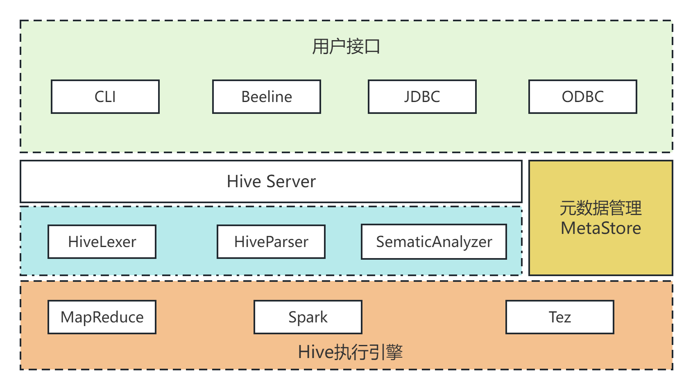

### Hive常用SQL语法实现分析
Hive是一个构建在Hadoop之上的数据仓库，提供类似SQL的查询语句HiveQL对数据进行分析处理(OLAP)。Hive将HiveQL语句转换一系列成Mapreduce作业并执行。目前，Hive除了支持MapReduce计算引擎，还支持Spark和Tez这两种分布式计算引擎。

#### join的实现
对于Hive来说，是可以轻松，将此SQL转换成MapReduce的。
```sql
select u.name, o.orderid from order o join user u on o.uid = u.uid;
```
实现思路：

join的实现其实有两种
- map join，避免了shuffle，也就不会产生数据倾斜了，使用有前提:必须是大小表join，小表还得足够小
- reduce join此时这个地方的实现逻辑就是reducejoin，最大的问题是会产生数据倾斜
#### group by实现
HQL代码如下
````sql
select rank, isonline, count(*) from city group by rank, isonline;
````

#### count(distinct x)实现
### Hive架构原理和执行过程
hive内部四大组件：*驱动器Driver*,*编译器Compiler*,*优化器Optimizer*,*执行器Executor*
- Driver 组件完成 HQL 查询语句从词法分析，语法分析，编译，优化，以及生成物理执行计划的生成。生成的物理执行计划存储在 HDFS 中，并随后由MapReduce 调用执行。整个编译过程分为六个阶段，一个完整的大致编译流程如下：

```
1、Antlr 定义 HQL 的语法规则，完成 SQL 词法，语法解析，将 SQL 转化为抽象语法树 AST Tree
2、遍历 AST Tree，抽象出查询的基本组成单元 QueryBlock (QueryBlock 理解成 子查询 最小的查询执行单元)
3、遍历 QueryBlock，翻译为执行操作树 OperatorTree, Operator 不可拆分的一个逻辑执行单元，Operator 对应到了 SQL 中的每一个关键字
4、逻辑层优化器进行 OperatorTree 变换，合并不必要的 ReduceSinkOperator，减少 shuffle 数据量
5、遍历 OperatorTree，翻译为 MapReduce 任务
6、物理层优化器进行 MapReduce 任务的变换，生成最终的执行计划
```
Hive 通过 ExecMapper 和 ExecReducer 执行 MapReduce 任务，在执行 MapReduce 时有两种模式：本地模式 和 分布式模式。
### Hive源码入口
通常我们提交HQL语句执行的方式有如下几种：
```
1.进入hive shell操作界面，进入交互时操作使用 hive > sql
2.hive -e "sql"
3.hive -i init.sql -f sql.file
4.hiveserver2 + beeline
```
无论是通过那种方式提交的 HQL ，最后都会走到统一的编译提交执行流程。在此，我们以最熟悉的 hive -e 的方式来作为入口！
解析 hive 脚本得知，HQL 的执行入口 Java 类：org.apache.hadoop.hive.cli.CliDriver