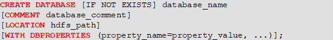

### 创建数据库

```sql
# 创建一个数据库不指定路径
create database db_hive1;
# 创建一个数据库 指定路径 是hdfs上的路径
create database db_hive2 location '/db_hive2';
# 创建一个数据库 带有dbproperties
create database db_hive3 with dbproperties('create_date'='2023-6-17');
```
### 查询数据库
#### 展示所有数据库
```sql
show databases like 'db_hive*';
```
#### 查看数据库信息
```sql
# 查看基本信息
desc database db_hive3;
# 查看更多信息
desc database extended db_hive3;
```
#### 修改数据库
用户可以使用alter database命令修改数据库某些信息，其中能够修改的信息包括dbproperties、location、owner user。需要注意的是：修改数据库location，不会改变当前已有表的路径信息，而只是改变后续创建的新表的默认的父目录。
```sql
# 语法
-- 修改dbproperties
ALTER DATABASE database_name SET DBPROPERTIES (property_name=property_name,...);
    
-- 修改location
ALTER DATABASE database_name SET LOCATION hdfs_path;
    
-- 修改owner user
ALTER DATABASE database_name SET OWNER USER user_name;
    
# 修改dbproperties
ALTER DATABASE db_hive3 SET DBPROPERTIES ('create_date'='2022-6-17');
```
#### 删除数据库
```sql
DROP DATABASE [IF EXISTS] database_name [RESTRICT|CASCADE];
```
注：RESTRICT：严格模式，若数据库不为空，则会删除失败，默认为该模式。
CASCADE：级联模式，若数据库不为空，则会将库中的表一并删除。
```sql
# 删除空数据库
drop database db_hive2;
# 删除非空数据库
drop database db_hive3 cascade;
```
#### 切换当前数据库
```sql
USE database_name;
```
### 表
```sql
# 完整语法
CREATE [TEMPORARY] [EXTERNAL] TABLE [IF NOT EXISTS] 
[db_name.]table_name
[(col_name data_type [COMMENT col_comment], ...)]
[COMMENT table_comment]
[PARTITIONED BY (col_name data_type [COMMENT col_comment], ...)]
[CLUSTERED BY (col_name, col_name, ...) 
[SORTED BY (col_name [ASC|DESC], ...)] INTO num_buckets BUCKETS]
[ROW FORMAT row_format]
[STORED AS file_format]
[LOCATION hdfs_path]
[TBLPROPERTIES (property_name=property_value, ...)]
-- TEMPORARY 临时表 该表只在当前会话可见 会话结束 表会被删除
    
-- EXTERNAL 外部表 与之相对应的是内部表（管理表）。管理表意味着Hive会完全接管该表，包括元数据和HDFS中的数据。而外部表则意味着Hive只接管元数据，而不完全接管HDFS中的数据。
-- PARTITIONED BY 创建分区
    
-- CLUSTERED BY ... SORTED BY...INTO...BUCKETS(重点) 创建分桶表
    
-- ROW FORMAT 指定SERDE，SERDE是Serializer and Deserializer的简写。Hive使用SERDE序列化和反序列化每行数据。详情可参考 Hive-Serde。语法说明如下：
-- 语法一：DELIMITED关键字表示对文件中的每个字段按照特定分割符进行分割，其会使用默认的SERDE对每行数据进行序列化和反序列化。
-- fields terminated by ：列分隔符
-- collection items terminated by ： map、struct和array中每个元素之间的分隔符
-- map keys terminated by ：map中的key与value的分隔符
-- lines terminated by ：行分隔符
-- 语法二：SERDE关键字可用于指定其他内置的SERDE或者用户自定义的SERDE。例如JSON SERDE，可用于处理JSON字符串。
    
-- STORED AS 指定文件格式，常用的文件格式有，textfile（默认值），sequence file，orc file、parquet file等等。
    
-- LOCATION 指定表所对应的HDFS路径，若不指定路径，其默认值为 ${hive.metastore.warehouse.dir}/db_name.db/table_name
    
-- TBLPROPERTIES 用于配置表的一些KV键值对参数
```
```sql
基本数据类型
-- data_type hive中的字段可分为基本数据类型和复杂数据类型
-- tinyint  1byte有符号整数
-- smallint 2byte有符号整数
-- int      4byte有符号整数
-- bigint   8byte有符号整数
-- boolean  布尔类型 true或者false
-- float    单精度浮点数
-- double   双精度浮点数
-- decimal  十进制精准数字类型
-- varchar  字符序列，需指定最大长度，最大长度的范围是[1,65535]
-- string   字符串 无需指定最大长度
-- timestamp  时间类型
-- binary   二进制数据
复制数据类型
-- array 数组是一组相同类型的值的集合 array<string>  arr[0]
-- map   map是一组相同类型的键-值对集合 map<string,int> map['key']
-- struct 结构体由多个属性组成，每个属性都有自己的属性名和数据类型 struct<id:int,name:string> struct.id
```
类型转换
```
hive的基本数据类型都可以做类型转换 转换的方式包括隐式转换以及显示转换
```
隐式转换
```
a.任何整数类型都可以转换为一个范围更广的类型，如tinyint可以转换成int int可以转换成bigint
b.所有整数类型、float和string类型都可以隐式转换成double
c.tinyint、smallint、int都可以转换成float
d.boolean类型不可以转换为任何其它的类型
```
显示转换
```sql
select '1' + 2, cast('1' as int) + 2;
```
#### 内部表语外部表
##### 内部表
Hive中默认创建的表都是的内部表，有时也被称为管理表。对于内部表，Hive会完全管理表的元数据和数据文件。
```sql
create table if not exists student(
    id int,
    name string
)
row format delimited fields terminated by '\t'
location '/opt/software/student.txt';
```
##### 外部表
外部表通常可用于处理其他工具上传的数据文件，对于外部表，Hive只负责管理元数据，不负责管理HDFS中的数据文件。
```sql
create external table if not exists student2(
    id int,
    name string
)
row format delimited fields terminated by '\t'
location '/user/hive/warehouse714/student'; --此目录是文件夹目录
```
##### SERDE和复杂数据类型
数据
```json
{"name":"dasongsong","friends":["bingbing","lili"],"students":{"xiaohaihai":18,"xiaoyangyang":16},"address":{"street":"hui long guan","city":"beijing","postal_code":10010}}
```
```sql
create external table teacher
(
    name string,
    friends array<string>,
    students map<string,int>,
    address struct<city:string,street:string,postal_code:int>
)
row format serde 'org.apache.hadoop.hive.serde2.JsonSerDe'
location '/user/hive/warehouse714/teacher';
```
```sql
create table teacher1 as select * from teacher;
create table teacher2 like teacher;
```
#### 查看表
```sql
show tables like 'stu*';
-- 查看基本信息
desc stu;
-- 查看更多信息
desc formatted stu;
```
#### 修改表
##### 重命名表
```sql
alter table student1 rename to student11;
```
##### 修改信息列表
```sql
-- 增加列 ALTER TABLE table_name ADD COLUMNS (col_name data_type [COMMENT col_comment], ...)
-- 更新列 ALTER TABLE table_name CHANGE [COLUMN] col_old_name col_new_name column_type [COMMENT col_comment] [FIRST|AFTER column_name]
-- 替换列 ALTER TABLE table_name REPLACE COLUMNS (col_name data_type [COMMENT col_comment], ...)

-- 查看表结构
desc stu;
-- 添加列
alter table stu add columns(age int);
-- 更新列
alter table stu change column age ages double;
-- 替换列
alter table stu replace columns(id int, name string);
```
#### 删除表
```sql
drop table stu;
```
#### 清空表
```sql
truncate table student;
```
### DML数据操作
#### Load
Load语句可将文件导入到hive中
```sql
LOAD DATA [LOCAL] INPATH 'filepath' [OVERWRITE] INTO TABLE tablename [PARTITION (partcol1=val1, partcol2=val2 ...)];
-- local 表示从本地加载数据到Hive表；否则从HDFS加载数据到Hive表。
-- overwrite：表示覆盖表中已有数据，否则表示追加。
-- partition：表示上传到指定分区，若目标是分区表，需指定分区。
create table student_load(
    id int,
    name string
)
row format delimited fields terminated by '\t';

-- 加载本地文件到hive
load data local inpath '/opt/student.txt' into table student_load;
    
-- 加载hdfs上的数据
load data  inpath '/opt/student.txt' into table student_load;
    
-- 加载数据覆盖表中已有的数据
load data  inpath '/opt/student.txt' overwrite into table student_load;
```
#### Insert
##### 将查询结插入表中
```sql
INSERT (INTO | OVERWRITE) TABLE tablename [PARTITION (partcol1=val1, partcol2=val2 ...)] select_statement;
-- INTO:将结果追加到目标表
-- OVERWRITE:用结果覆盖原有数据
create table student_insert(
    id int,
    name string
)
row format delimited fields terminated by '\t';

-- 根据查询结果插入数据
insert overwrite table student_insert 
select id,name from student_load; 
```
##### 将给定Values插入表中
```sql
INSERT (INTO | OVERWRITE) TABLE tablename [PARTITION (partcol1[=val1], partcol2[=val2] ...)] VALUES values_row [, values_row ...]
    
insert into table student_insert values(1,"meicilly"),(2,"hihi");
```
##### 将查询结果写入目标路径
```sql
INSERT OVERWRITE [LOCAL] DIRECTORY directory
[ROW FORMAT row_format] [STORED AS file_format] select_statement;
    
insert overwrite local directory '/opt/module/datas/student' ROW FORMAT SERDE 'org.apache.hadoop.hive.serde2.JsonSerDe'
select id,name from student;
```
#### Export&Import
```sql
--导出
EXPORT TABLE tablename TO 'export_target_path'

--导入
IMPORT [EXTERNAL] TABLE new_or_original_tablename FROM 'source_path' [LOCATION 'import_target_path']
    
--导出
hive>
export table default.student to '/user/hive/warehouse/export/student';

--导入
hive>
import table student2 from '/user/hive/warehouse/export/student';
```
### 查询
#### 基础语法
```sql
SELECT [ALL | DISTINCT] select_expr, select_expr, ...
FROM table_reference       -- 从什么表查
[WHERE where_condition]   -- 过滤
[GROUP BY col_list]        -- 分组查询
   [HAVING col_list]          -- 分组后过滤
[ORDER BY col_list]        -- 排序
[CLUSTER BY col_list
| [DISTRIBUTE BY col_list] [SORT BY col_list]
[LIMIT number]                -- 限制输出的行数
```
#### 基本查询
```sql
-- 创建部门表
create table if not exists dept1(
    deptno int comment '部门编号',
    dname string comment '部门名称',
    loc int comment '部门位置'
)
row format delimited fields terminated by '\t';

-- 创建员工表
create table if not exists emp(
    empno int comment "员工编号",
    ename string comment "员工姓名",
    job string comment "员工岗位",
    sal double comment "员工薪资",
    deptno int comment "部门编号"
)
row format delimited fields terminated by "\t";

load data local inpath "/opt/dept.txt" into table dept1;
load data local inpath "/opt/emp.txt" into table emp;
```
#### 全表和特定列查询
```sql
-- 全表查询
select * from emp;
-- 选择特定列查询
select empno,ename from emp;
-- 列别名
select ename AS name, deptno dn from emp;
-- limit语句
select * from emp limit 5;
select * from emp limit 2,3; --表示从第二行开始 向下抓取3行
-- where语句
select * from emp where sal > 1000;
-- 操作符	支持的数据类型	描述
-- A=B	基本数据类型	如果A等于B则返回true，反之返回false
-- A<=>B	基本数据类型	如果A和B都为null或者都不为null，则返回true，如果只有一边为null，返回false
-- A<>B, A!=B	基本数据类型	A或者B为null则返回null；如果A不等于B，则返回true，反之返回false
-- A<B	基本数据类型	A或者B为null，则返回null；如果A小于B，则返回true，反之返回false
-- A<=B	基本数据类型	A或者B为null，则返回null；如果A小于等于B，则返回true，反之返回false
-- A>B	基本数据类型	A或者B为null，则返回null；如果A大于B，则返回true，反之返回false
-- A>=B	基本数据类型	A或者B为null，则返回null；如果A大于等于B，则返回true，反之返回false
-- A [not] between B and C	基本数据类型	如果A，B或者C任一为null，则结果为null。如果A的值大于等于B而且小于或等于C，则结果为true，反之为false。如果使用not关键字则可达到相反的效果。
-- A is null	所有数据类型	如果A等于null，则返回true，反之返回false
-- A is not null	所有数据类型	如果A不等于null，则返回true，反之返回false
-- in（数值1，数值2）	所有数据类型	使用 in运算显示列表中的值
-- A [not] like B	string 类型	B是一个SQL下的简单正则表达式，也叫通配符模式，如果A与其匹配的话，则返回true；反之返回false。B的表达式说明如下：‘x%’表示A必须以字母‘x’开头，‘%x’表示A必须以字母‘x’结尾，而‘%x%’表示A包含有字母‘x’,可以位于开头，结尾或者字符串中间。如果使用not关键字则可达到相反的效果。
-- A rlike B, A regexp B	string 类型	B是基于java的正则表达式，如果A与其匹配，则返回true；反之返回false。匹配使用的是JDK中的正则表达式接口实现的，因为正则也依据其中的规则。例如，正则表达式必须和整个字符串A相匹配，而不是只需与其字符串匹配。

-- 查询薪水大于1000 部门是30
select * from emp where sal > 1000 and deptno = 30;
-- 查询薪水大于1000 或者部门是30
select * from emp where sal > 1000 or deptno=30;
```
#### 聚合函数
```
count(*) 表示统计所有行数 包含null值
count(某列)，表示该列一共有多少行，不包含null值
max()，求最大值，不包含null，除非所有值都是null
min()，求最小值，不包含null，除非所有值都是null
sum()，求和，不包含null
avg()，求平均值，不包含null
```
```sql
-- 求总行数
select count(*) cnt from emp;
-- 求工资最大值
select max(sal) max_sal from emp;
-- 求工资的最小值
select min(sal) min_sal from emp;
-- 求工资的总和
select sum(sal) sum_sal from emp;
-- 求工资的平均值
select avg(sal) avg_sal from emp;

-- 求每个部门的平均工资
select deptno,avg(sal) from emp group by deptno;
-- 求每个部门的平均薪水大于2000的部门
select deptno,avg(sal) avg_sal from emp group by deptno having avg_sal > 2000;
```
#### Join语句
```sql
-- 根据员工表和部门表中的部门编号相等，查询员工编号、员工名称和部门名称
select e.empno,e.ename,d.dname from emp e join dept d on e.deptno = d.deptno;
-- 合并员工表和部门表
select e.*,d.* from emp e join dept d on e.deptno = d.deptno;
```
##### 内连接
```sql
-- 内连接：只有进行连接的两个表中都存在与连接条件相匹配的数据才会被保留下来。
select e.empno,e.ename,d.dname from emp e inner join dept1 d on e.deptno = d.deptno;
-- 左外连接：join操作符左边表中符合where子句的所有记录将会被返回。
select e.empno,e.ename,d.dname from emp e left join dept1 d on e.deptno = d.deptno;
-- 左外连接：join操作符左边表中符合where子句的所有记录将会被返回。
select e.empno,e.ename,d.dname from emp e right join dept1 d on e.deptno = d.deptno;
-- 满外连接：将会返回所有表中符合where语句条件的所有记录。如果任一表的指定字段没有符合条件的值的话，那么就使用null值替代
select e.empno,e.ename,d.dname from emp e full join dept1 d on e.deptno = d.deptno;
-- 多表连接 注意：连接n个表，至少需要n-1个连接条件。例如：连接三个表，至少需要两个连接条件
create table if not exists location(
    loc int,
    loc_name string
)
row format delimited fields terminated by '\t';
load data local inpath '/opt/location.txt' into table location;
-- 多表查询
select e.empno,e.ename,d.dname from emp e  
    join dept1 d 
    on e.deptno = d.deptno
    join location l
    on d.loc = l.loc;
-- 笛卡尔集
select empno,dname from emp,dept;
-- 联合查询
-- union&union all上下拼接
-- union和union all都是上下拼接sql的结果，这点是和join有区别的，join是左右关联，union和union all是上下拼接。union去重，union all不去重。
-- union和union all在上下拼接sql结果时有两个要求：
-- （1）两个sql的结果，列的个数必须相同
-- （2）两个sql的结果，上下所对应列的类型必须一致
select * from emp where deptno = 30 union select * from emp where deptno = 40;
```
#### 排序
##### 全局排序order by
```sql
-- Order By：全局排序，只有一个Reduce
-- asc(ascend):升序（默认）  desc(descend):降序
select * from emp order by sal;
select * from emp order by sal desc;
```
##### 每个Reduce内部排序（Sort By）
```sql
-- Sort By：对于大规模的数据集order by的效率非常低。在很多情况下，并不需要全局排序，此时可以使用Sort by。
-- Sort by为每个reduce产生一个排序文件。每个Reduce内部进行排序，对全局结果集来说不是排序。
-- 设置reduce个数
set mapreduce.job.reduces=3;
-- 查看设置reduce个数
set mapreduce.job.reduces;
-- 根据部门编号降序查看员工信息
select
    *
from emp
         sort by deptno desc;
```
##### 分区（Distribute By）
Distribute By：在有些情况下，我们需要控制某个特定行应该到哪个Reducer，通常是为了进行后续的聚集操作。distribute by子句可以做这件事。distribute by类似MapReduce中partition（自定义分区），进行分区，结合sort by使用。
对于distribute by进行测试，一定要分配多reduce进行处理，否则无法看到distribute by的效果。
- distribute by的分区规则是根据分区字段的hash码与reduce的个数进行相除后，余数相同的分到一个区。
- Hive要求distribute by语句要写在sort by语句之前。
- 演示完以后mapreduce.job.reduces的值要设置回-1，否则下面分区or分桶表load跑MapReduce的时候会报错。
##### 分区排序（Cluster By）
- 当distribute by和sort by字段相同时，可以使用cluster by方式。
- cluster by除了具有distribute by的功能外还兼具sort by的功能。但是排序只能是升序排序，不能指定排序规则为asc或者desc。

### 函数
```sql
-- 查看系统内置函数
show functions;
-- 查看内置函数用法
desc function upper;
-- 查看内置函数详细信息
desc function extended upper;
```
#### 单行函数
##### 算数运算函数
```sql
-- 查询出所有员工的薪水后加1显示
select sal + 1 from emp1;
```
##### 数值函数
```sql
-- round 四舍五入
select round(3.3);
-- ceil 向上取整
select ceil(3.1);
-- 向下取整
select  floor(4.8);
```
##### 字符串函数
- substring：截取字符串
- 语法一：substring(string A, int start)
- 返回值：string
- 说明：返回字符串A从start位置到结尾的字符串
- 语法二：substring(string A, int start, int len)
- 返回值：string
- 说明：返回字符串A从start位置开始，长度为len的字符串
```sql
-- 获取第二个字符以后的所有字符
select substring("meicilly",2);
-- 获取倒数第三个字符以后的所有字符
select substring("meicilly",-3);
-- 获取倒数第三个字符以后 向后获取2个字符
select substring("meicilly",3,2);
```
- replace ：替换
- 语法：replace(string A, string B, string C)
- 返回值：string
```sql
select replace('meicilly','c','C');
```
- regexp_replace：正则替换
- 语法：regexp_replace(string A, string B, string C)
- 返回值：string
- 说明：将字符串A中的符合java正则表达式B的部分替换为C。注意，在有些情况下要使用转义字符。
```sql
select regexp_replace('100-200', '(\\d+)', 'num');
```
- regexp：正则匹配
- 语法：字符串 regexp 正则表达式
- 返回值：boolean
- 说明：若字符串符合正则表达式，则返回true，否则返回false。
```sql
select 'dfsaaaa' regexp 'dfsa+';
```
- repeat：重复字符串
- 语法：repeat(string A, int n)
- 返回值：string
- 说明：将字符串A重复n遍。
```sql
select repeat('123',3);
```
- split ：字符串切割
- 语法：split(string str, string pat)
- 返回值：array
- 说明：按照正则表达式pat匹配到的内容分割str，分割后的字符串，以数组的形式返回。
```sql
select split('a-b-c-d','-');
```
- nvl ：替换null值
- 语法：nvl(A,B)
- 说明：若A的值不为null，则返回A，否则返回B。
```sql
select nvl(null,1);
```
- concat ：拼接字符串
- 语法：concat(string A, string B, string C, ……)
- 返回：string
- 说明：将A,B,C……等字符拼接为一个字符串
```sql
select concat('beijing','-','shanghai','-','shenzhen');
```
- concat_ws：以指定分隔符拼接字符串或者字符串数组
- 语法：concat_ws(string A, string…| array(string))
- 返回值：string
- 说明：使用分隔符A拼接多个字符串，或者一个数组的所有元素。
```sql
select concat_ws('-','beijing','shanghai','shenzhen');
select concat_ws('-',array('beijing','shenzhen','shanghai'));
```
- get_json_object：解析json字符串
- 语法：get_json_object(string json_string, string path)
- 返回值：string
- 说明：解析json的字符串json_string，返回path指定的内容。如果输入的json字符串无效，那么返回NULL。
```sql
select get_json_object('[{"name":"大海海","sex":"男","age":"25"},{"name":"小宋宋","sex":"男","age":"47"}]','$.[0].name');
```
##### 日期函数
- unix_timestamp：返回当前或指定时间的时间戳
- 语法：unix_timestamp()
- 返回值：bigint 
```sql
select unix_timestamp('2022/08/08 08-08-08','yyyy/MM/dd HH-mm-ss'); 
```
- from_unixtime：转化UNIX时间戳（从 1970-01-01 00:00:00 UTC 到指定时间的秒数）到当前时区的时间格式
- 语法：from_unixtime(bigint unixtime[, string format])
- 返回值：string 
```sql
select from_unixtime(1659946088); 
-- current_date 当前日期
select current_date;
-- 当前的时期加时间 并且精确的毫秒
select current_timestamp;  
```
- month：获取日期中的月
- 语法：month (string date)
- 返回值：int 
```sql
select month('2022-08-08 08:08:08');
```
- day：获取日期中的日
- 语法：day (string date)
- 返回值：int 
```sql
select day('2022-08-08 08:08:08');
```
- hour：获取日期中的小时
- 语法：hour (string date)
- 返回值：int 
```sql
select hour('2022-08-08 08:08:08'); 
```
- datediff：两个日期相差的天数（结束日期减去开始日期的天数）
- 语法：datediff(string enddate, string startdate)
- 返回值：int 
```sql
select datediff('2021-08-08','2022-10-09');
```
- date_add：日期加天数
- 语法：date_add(string startdate, int days)
- 返回值：string
- 说明：返回开始日期 startdate 增加 days 天后的日期
```sql
select date_add('2022-08-08',2);
```
- date_sub：日期减天数
- 语法：date_sub (string startdate, int days)
- 返回值：string
- 说明：返回开始日期startdate减少days天后的日期。
```sql
select date_sub('2022-08-08',2);
```
- date_format:将标准日期解析成指定格式字符串
```sql
select date_format('2022-08-08','yyyy年-MM月-dd日');
```
##### 流程控制函数
- case when：条件判断函数
- 语法一：case when a then b [when c then d]* [else e] end
- 返回值：T
- 说明：如果a为true，则返回b；如果c为true，则返回d；否则返回 e
```sql
select case when 1=2 then 'tom' when 2=2 then 'mary' else 'tim' end from tabl eName; 
```
- if: 条件判断，类似于Java中三元运算符
- 语法：if（boolean testCondition, T valueTrue, T valueFalseOrNull）
- 返回值：T
- 说明：当条件testCondition为true时，返回valueTrue；否则返回valueFalseOrNull
```sql
select if(10 > 5,'正确','错误'); 
select if(10 < 5,'正确','错误');
```
- if: 条件判断，类似于Java中三元运算符
- 语法：if（boolean testCondition, T valueTrue, T valueFalseOrNull）
- 返回值：T
- 说明：当条件testCondition为true时，返回valueTrue；否则返回valueFalseOrNull
```sql
-- 满足条件正确
select if(10 > 5,'正确','错误');
```
##### 集合函数
- size 集合中元素的个数
```sql
select size(friends) from test;
```
- map：创建map集合
- 语法：map (key1, value1, key2, value2, …)
- 说明：根据输入的key和value对构建map类型
```sql
select map('meicilly',1,'heihei',2);
-- map_keys 返回map中的key
select map_keys(map('meicilly',1,'heihei',2));
-- map_values 返回map中的value
select map_values(map('meicilly',1,'heihei',2));
```
- array 声明array集合
- 语法：array(val1, val2, …)
- 说明：根据输入的参数构建数组array类
```sql
select array('1','2','3','4');
-- array_contains 判断array中是否包含某个元素
select array_contains(array('a','b','c','d'),'a');
-- 将array中的元素排序
select sort_array(array('a','d','c'));
```
- struct声明struct中的各属性
- 语法：struct(val1, val2, val3, …)
- 说明：根据输入的参数构建结构体struct类
```sql
select struct('name','age','weight');
-- named_struct声明struct的属性和值
select named_struct('name','xiaosong','age',18,'weight',80);
```
### 高级聚合函数
```sql
-- collect_list收集并形成list集合 结果不去重
select
    sex,
    collect_list(job)
from
    emp
group by
    sex;
-- collect_set收集并形成set集合 结果去重
select
    sex,
    collect_set(job)
from
    employee
group by
    sex
```
### 分区表和分通表
#### 分区表
Hive中的分区就是把一张大表的数据按照业务需要分散的存储到多个目录，每个目录就称为该表的一个分区。在查询时通过where子句中的表达式选择查询所需要的分区，这样的查询效率会提高很多。
##### 创建分区表
```sql
-- 创建分区表
create table dept_partition
(
    deptno int,
    dname  string,
    loc    string
)
partitioned by (day string)
row format delimited fields terminated by '\t';
-- 写数据
load data local inpath '/opt/dept_20220401.log' into table dept_partition partition(day='20220401');
-- 将day='20220401'分区的数据插入到day='20220402'分区
insert overwrite table dept_partition partition (day = '20220402')
select deptno, dname, loc
from dept_partition
where day = '20220401';
-- 查看所有分区信息
show partitions dept_partition;
-- 增加分区
-- 创建单个分区
alter table dept_partition 
add partition(day='20220404');
-- 创建多个分区 中加不能有逗号
alter table dept_partition
add partition(day='20220404') partiton(day='20220405');
-- 删除分区
alter table dept_partition
drop partition(day='20220404');
-- 删除多个分区 中间必须有逗号
alter table dept_partition
drop partition(day='20220404'), partition(day='20220405');
```
##### 二级分区
```sql
create table dept_partition2(
    deptno int,
    dname string,
    loc string
)
partitioned by (day string,hour string)
row format delimited fields terminated by '\t';

load data local inpath '/opt/module/hive/datas/dept_20220401.log' 
into table dept_partition2 
partition(day='20220401', hour='12');


select
    *
from dept_partition2
where day='20220401' and hour='12';
```
##### 动态分区
