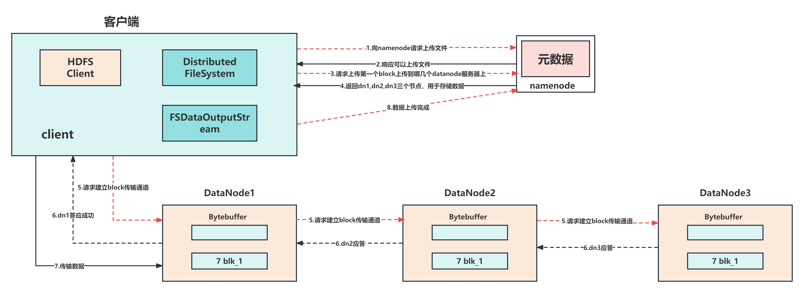
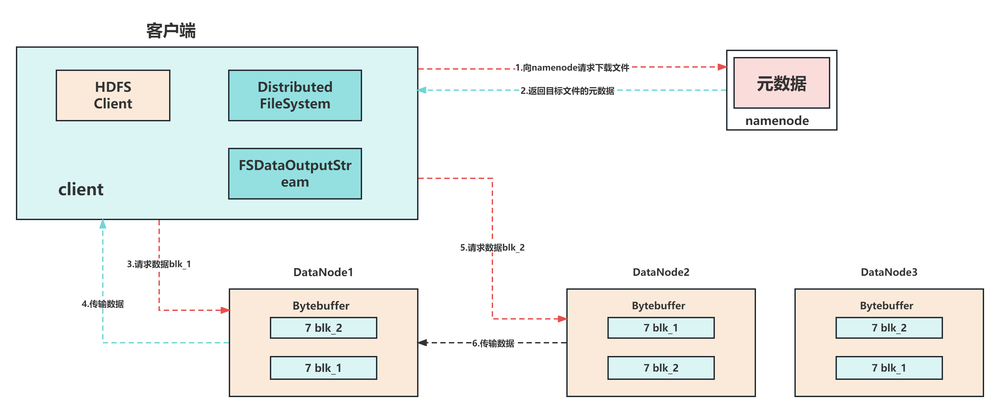

### HDFS文件的写流程(简略版)
1. 客户端通过Distributed FileSystem模块向NameNode请求上传文件，NameNode检查目标文件是否已经存在，父目录是否存在。
2. NameNode返回是否可以上传。
3. 客户端请求第一个block上传到哪几个datanode服务器上。
4. NameNode返回3个datanode节点，分别为dn1、dn2、dn3。
5. 客户端通过FSDataOutputStream模块请求dn1上传数据，dn1收到请求会继续调用dn2，然后dn2调用dn3，将这个通信管道建立完成。
6. dn1,dn2,dn3逐级但应客户。
7. 客户端开始往dn1上传第一个block(先从磁盘读取数据放到一个本地内存缓存)，以packet为单位，dn1收到一个packet就会传给dn2,dn2传给dn3;dn1每传一个packet会放入一个应答队列等待应答。
8. 当一个block传输完成之后，客户端再次请求NameNode上传第二个block的服务器。（重复执行3-7步）。

### HDFS读数据流程(简略版)
1. 客户端向NameNode请求读文件，NameNode通过查询元数据，找到文件块所在的DataNode地址，并返回地址给客户端。
2. 挑选一台DataNode(就近原则，然后随机)服务器，请求读取数据
3. DataNode开始传输数据给客户端（从磁盘里面读取数据入流，以packet为单位校验）
4. 客户端以packet为单位接收，先在本地缓存，然后写入目标文件
5. 关闭资源

### HDFS的容错机制
#### 故障检测机制
1. 针对DataNode失效问题
每个DataNode以固定的周期向NameNode发送心跳信号，通过这种方法告诉NameNode它们在正常工作。如果在一定的时间内NameNode没有收到DataNode心跳，就任务该DataNode宕机了。
2. 针对网络故障而导致无法收发数据
HDFS提供ACK的机制，在发送端发送数据后，如果没有手动ACK并且经过多次重试后仍然如此，则认为网络故障。
3. 针对数损坏(脏数据)问题
- 在传输数据的时候，同时会发送总和校验码，当数据存储到硬盘时，总和校验码也会被存储
- 所有DataNode都会定期向NameNode发送数据块的存储情况
- 在发送数据块报告前，会先检查总和校验码是否正确，如果数据存在错误就不发送该数据块的信息
### HDFS的常见数据格式，列式存储格式和行存储格式异同点，列式存储优点有哪些
- Hadoop中的文件格式大致上分为面向行和面向列两类
1. 行式存储
一条数据保存为一行，读取一行中的任何值都需要把整行数据读取出来(如：Sequence Files,MapFile,Avro Data Files),这种方式在磁盘读取的开销比较大，这无法避免。
2. 列式存储
整个文件被切割为若干列数据，每一列中数据保存在一起(如：Parquet,RC Files,ORC Files,Carbon Data,IndexR)。这种方式会占用更多的内存空间，需要将行数据缓存起来。
- 列存储和行存储优缺点
```
行存储
优点：行存储的写入是一次性完成的，写入效率高，消耗时间比列存储少，并且能够保证数据的完整性
缺点：数据读取过程中会产生冗余数据，如果只少看数据，此影响可以忽略；数量大可能会影响数据的处理效率。
```
```
列存储
优点：在读取过程中，不会产生冗余数据，这对数据完整性要求不高的大数据处理领域尤为重要
缺点：写入效率，保证数据完整性上都不如行存储
```
### HDFS如何保证数据不丢失
1. 数据在写入之后进行校验和的计算，DataNode周期性的进行校验和计算，将计算结果与第一次进行对比，若同时表示无数据丢失，若不相同表示数据丢失，丢失后进行数据修复。
2. 数据读取之前对数据进行校验，与第一次的结果进行对比，若相同表示数据没有丢失，可以读取，若不相同表示数据有所丢失，到其他副本读物数据。
#### 保证DataNode节点保证数据完整性的方法
1. 当DataNode读取Block的时候，会计算CheckSum
2. 如果计算后的CheckSum,与Block创建是值不一样，说明Block已经损坏
3. Client读取其他DataNode上的Block
4. 常见的校验算法crc(32), md5(128), sha1(160)
5. DataNode在其文件创建后周期验证CheckSum
### 介绍下HDFS的Block
#### Block概念
磁盘有一个Block size的概念，它是磁盘读/写数据的最小单位。构建在这样的磁盘上的文件也是通过块来管理数据的，文件系统的块通常是磁盘块的整数倍。文件系统的块一般为几千字节（byte）,磁盘块一般为512字节（byte）。
HDFS也有Block的概念，但它的块是一个很大的单元，默认是64MB。像硬盘中的文件系统一样，在HDFS中的文件将会按块大小进行分解，并作为独立的单元进行存储。但和硬盘中的文件系统不一样的是，存 储在块中的硬的一个比块小的文件并不会占据一个块大小盘物理空间（HDFS中一个块只存储一个文件的内容）。
#### 对HDFS进行块抽象有哪些好处呢
1. 一个显而易见的好处是：一个文件的大小，可以大于网络中任意一个硬盘的大小
```
文件的块并不需要存储在同一个硬盘上，一个文件的块可以分布在集群中任意一个硬盘上。事实上，虽然实际中并没有，整个集群可以只存储一个文件，该文件的块占满整个集群的硬盘空间
```
2. 使用抽象块而非整个文件作为存储单元，大大简化了系统的设计。
```
简化设计，对于故障种类繁多的分布式系统来说尤为重要。以块为单位，一方面简化存储管理，因为块大小是固定的，所以一个硬盘放多少个块是非常容易计算的；另一方面，也消除了元数据的顾虑，因为Block仅仅是存储的一块数据，其文件的元数据，例如权限等就不需要跟数据块一起存储，可以交由另外的其他系统来处理。
```
3. 块更适合于数据备份，进而提供数据容错能力和系统可用性。
```
为了防止数据块损坏或者磁盘或者机器故障，每一个block都可以被分到少数几天独立的机器上(默认3台)。这样，如果一个block不能用了，就从其他的一处地方，复制过来一份。
```
### HDFS-核心参数
#### NameNode内存生产配置
1. NameNode内存计算
```
每个文件块大概占用150byte,一台服务器128G内存为例，能存储多少文件块呢？
128 * 1024 * 1024 * 1024 / 150Byte ≈ 9.1亿
G     MB     KB     Byte
```
2. Hadoop2.x系列，配置NameNode内存
```
NameNode内存默认2000m,如果服务器内存4G,NameNode内存可以配置3G,在hadoop-env.sh文件中配置如下
HADOOP_NAMENODE_OPTS=-Xmx3072m
```
3. Hadoop3.x系列，配置NameNode内存
```
jmap -heap 进程号
```
#### 心跳并发配置
```
NameNode有一个工作线程池，用来处理不同DataNode的并发心跳以及客户端并发的元数据操作
<property>
    <name>dfs.namenode.handler.count</name>
    <value>21</value>
</property>
```
#### 配置垃圾回收时间
1. 回收站工作机制
2. 开启回收站功能参数说明
```
1.默认值fs.trash.interval=0,0表示禁用回收站:其他值表示设置文件存活时间
2.默认值fs.trash.checkpoint.interval=0,检查回收站间隔时间。如果该值为0，则设置和fs.trash.interval的参数值相等
3.要求fs.trash.checkpoint.interval<=fs.trash.interval
```
3. 启用回收站
修改core-site.xml,配置垃圾回收时间为1分钟
```
<property>
    <name>fs.trash.interval</name>
    <value>1</value>
</property>
```