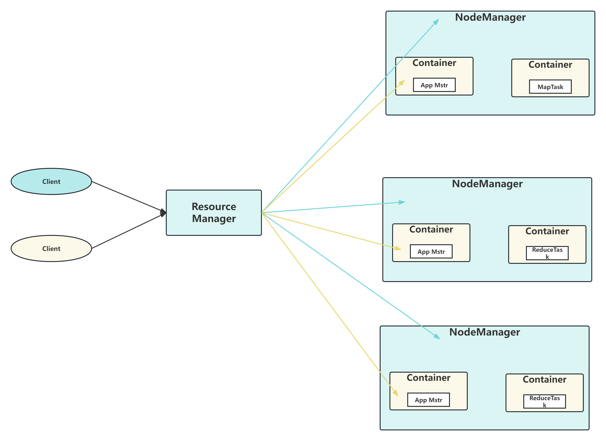

### 介绍一下YARN
- YARN是一个资源调度平台，负责为运算程序提供服务器运算资源，相当于一个分布式的操作系统平台，而MapReduce等运算程序则相当于运行于操作系统之上的应用程序。
- YARN作为一个资源管理、任务调度框架，主要包含ResourceManager、NodeManager、ApplicationMaster和Container模块。
#### YARN基础架构
- ResourceManager(RM)主要作用如下
```
处理客户端请求
监控NodeManager
启动或监控ApplicationMaster
资源的分配与调度
```
- NodeManager(NM)主要作用如下
```
管理单个节点上的资源
处理来自ResourceManager的命令
处理来自ApplicationMaster的命令
```
- ApplicationMaster(AM)作用如下
```
用应用程序申请资源分配给内部的任务
任务的监督与容错
```
- Container
```
Container是YARN中的资源抽象，它封装了某个节点上的多维度资源，如内存、CPU、磁盘、网络等。
```

### YARN的工作机制
1. Mapreduce程序提交到客户端所在的节点。
2. YarnRunner向ResourceManager申请一个Application
3. RM将该应用程序的资源路径以及application_id返回给YarnRunner
4. 该程序将运行所需资源提交到HDFS上
5. 程序资源提交完毕后，申请运行mrAppMaster
6. RM将用户的请求初始化成一个Task
7. 其中一个NodeManager领取到Task任务
8. 该NodeManager创建容器Container，并产生MRAppmaster
9. Container从HDFS上拷贝资源到本地
10. MRAppmaster向RM申请运行MapTask资源
11. RM将运行MapTask任务分配给另外两个NodeManager,另两个NodeManager分别领取任务并创建容器
12. MR向两个接收到任务的NodeManager发送程序启动脚本，这两个NodeManager分别启动MapTask，MapTask对数据分区排序
13. MrAppMaster 等待所有 MapTask 运行完毕后，向 RM 申请容器，运行 ReduceTask
14. ReduceTask 向 MapTask 获取相应分区的数据
15. ）程序运行完毕后，MR 会向 RM 申请注销自己
### YARN有什么优势 能解决什么问题
#### YARN的优点
- 解决了单点故障的问题，由于每一个任务由一个AppMaster进行调度，且可进行AppMaster出错重试，从而使单点故障影响到多个任务进行的问题不存在。
- 解决了单点压力过大问题，每一个任务由一个AppMaster进行调度，而每一个AppMaster都是由集群中资源较为充足的结点进行启动，调度任务，起到一个负载均衡的作用
- 完成了资源管理和任务调度的解耦，Yarn只负责对集群资源的管理，各个计算框架只要继承了AppMaster，就可以共同使用Yarn资源管理，更加充分地利用集群资源
### YARN的容错机制
#### 任务失败
任务失败可能存在以下几种情况:
- MapTask或者ReduceTask中由于代码原因抛出异常，jvm在关闭之前，会通知mrAppMaster这个task任务失败，在mrAppMaster中，错误报告被写到用户日志并且任务标记为失败，并释放jvm资源，供其他任务使用。对于streaming任务，如果streaming进程非0退出代码退出，则标记为失败。这种行为由stream.non.zero.is.failure属性(默认值为true)控制。
- jvm突然退出，可能是由于jvm缺陷而导致mr用户代码由于某种原因造成jvm退出。nodeManager会将这个消息通知到mrAppMaster，标记此次任务失败。
- 任务挂起(可能是由于资源不足造成):一旦mrAppMaster一段时间没有收到进度的更新，则将任务标记为失败，nodeManager会将该jvm进程杀死。任务失败时长可以由mapreduce.task.timeout来设置。如果为0 ，则表示关闭。如果关闭这个属性，那么可能会造成长时间运行的任务不会被标记为失败，被挂起的任务就会一直不被释放资源，长时间会造成集群效率降低，因此尽量避免这个设置。同时充分保证每个任务定期更新进度。
- 处理阶段 当mrAppMaster被告知，一个任务失败的时候，会重新调度该任务。mrAppMaster会尝试避免在以前失败过的nodeManager重新调度该任务。此外，一个任务失败的次数超过3次，就不会再重新调度。这个数值由mapreduce.map.maxattempts控制。如果一个任务失败次数大于该属性设置的，则整个作业都会失败。对于一些应用程序中，不希望少部分任务失败，而导致整个作业失败，因为即使一些任务失败，作业的输出结果也是可用的，我们可用通过运行任务失败的最大比例：maptask由mapreduce.map.failures.maxpercent，reducetask由mapreduce.reduce.failures.maxpercent来设置。任务尝试也是可以用来中止（killed），因为它是一个推测副本（如果一个任务执行时间比预期的慢的时候，会启动另外一个相同的任务作为备份，这个任务为推测执行）或者它所在的nodeManager失败，导致该nodeManager所执行的任务被标记为killed，被中止的任务是不会被记录到任务运行尝试次数。
##### ApplicationMaster运行失败
在YARN中，ApplicationMaster有几次尝试次数，最多尝试次数由：mapreduce.am.max-attempts和yarn.resourcemanager.am.max-attempts确定，默认为2。
### YARN调度器
